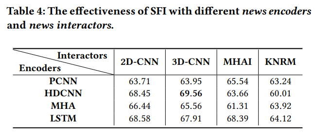
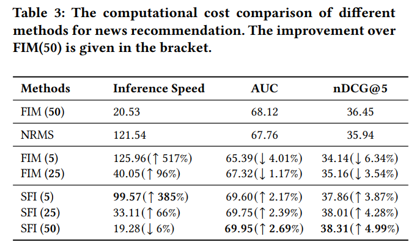
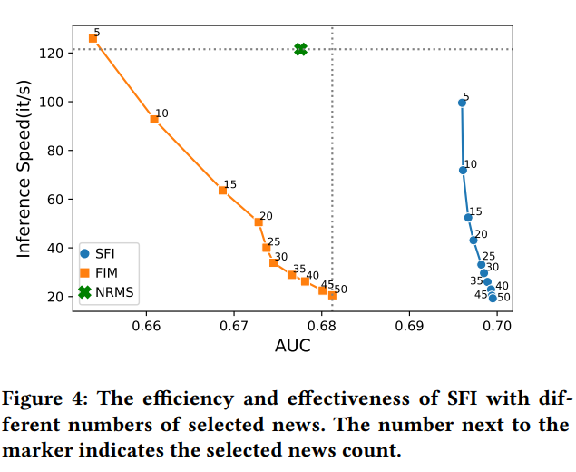

# Selective Fine-grained Interaction for Neural News Recommendation

## 1.使用SOTA的representation-based encoder来encode news
- According to the design pipeline, it seems that what we need from the news encoder is just a model that can convert the article (or the title of the article) to a vector representation, and this can be done offline after training the model. Thus, it seems to me that any existing representation-based methods can be used as the news encoder, including those in the baselines. It would be interesting to check if using the state-of-the-art representation-based models could improve news encoder and then history selector.
- in Results of Efficiency, I wonder if it is fair to compare SFI(5) and FIM(50), since their historical news are not same(5 and 50).
### 已经做的
- 我用了普通CNN, RNN, Self-Attention 和Dilated CNN, 这些就是News-Recommendation里的SOTA encoder呀, 还有对比的表格

### 修改
- 省去对news encoder和interactor不需要额外设计的强调, 在ablation里和sota的encoder对比, 在方法中阐明这一点

## 2.和recent K对比
- it's more important to compare the effectiveness and efficiency of history selector with naive selector (e.g., most recent K articles) than comparing the proposed model with other baselines. However, there is no comparison on the performance and efficiency of SFI with recent K articles and SFI with history selector. Thus, we don't know whether the superior performance of SFI really comes from the history selector or just comes from other components.
### 已经做的
- 我对比了recentK和selectK, 首先有一个表格对比NRMS, SFI(5), FIM(5), SFI(50)和FIM(50)
:
- 还画了图
    
- 解释了3点:
  - 同一个K下, SFI(K)比FIM(K)效果好, 这是因为SFI可以inspect到很以前的历史, 而FIM只能看K篇
  - 随着K增大, SFI(K)和FIM(K)的effectiveness都在提升, 这是因为随着capacity变大, 模型有更充分的历史来建模用户兴趣；同时, SFI(K)的effectiveness比FIM(K)增大地慢, 这是因为模型在选出30条历史时基本就可以充分建模用户, 而这30篇中有可能有多篇是在K>30的位置上的, 因此FIM只有在K更大时才能与其交互
  - 随着K增大, SFI(K)的FIM(K)的efficiency都在降低, 这是因为计算更多的历史记录需要的时间更；同时, 两者efficiency的差距在减小, 这是因为无论K为多少, selection操作需要的时间是恒定的, 因此最开始K小的时候, 这个时间比较明显, 后来K变大, 就变得不明显了

### 修改
- 论文中给FIM重命名为SFI-Naive, 这样应该比较方便对比

## 3.引用别的领域比如adhoc retrieval, product recommendation中相关的interaction-based 文献

### 改正
- 这里不太明白要怎么引, 有一些比较著名的么？
- 这个人发了一篇: While interaction-based models are not extensively studied in the domain of news recommendation, it has already been widely studied in other highly related domain such ad-hoc retrieval, product recommendation, product search, etc. (e.g., [1]) It may make sense to add more references to them in the paper.
- 我还估计是我引用文献改的太短了, 可以稍微长一点

## 4.一个没看懂的review
- Nevertheless, the results shown in the tables claim that the proposed model can have a certain level of high-granularity interpretation of the **recommendation reasoning**, yet the performance in terms of multiple metrics is still outperforming the other state-of-the-art methods.
- for the document embedding, using the mapping matrix of size V x D is for the sake of word-level interpretability, but have you tried to compare with other popular NLP embedding representations? Do they have excellent performance because the semantic meaning of the whole news article is captured even though the interpretability is lost?
- The whole article is application-oriented and less research involved since it spends most of its content discussing the module design.

## 5.创新性不够
- In my opinion, the difference between SFI and baseline method FIM is just History Selector Module. However, there are no novel highlights in the hard-selection networks and soft-selection networks. These methods are relatively simple and obvious, which makes it seem easy to solve the efficiency problems.

### 改正
- 或许可以不要那么强调FIM？
- 我怀疑这个人没有认真看论文

## 6.认为hard-selection没有用
-  I doubt whether hard-selection network is necessary and maybe soft-selection network itself could achieve the functions as well.
### 改正
- 这个人没有认识到不hard是没法提速的。。因此我觉得论文里应该强调这一点

## 7.认为用SFI(5)和FIM(50)比不够公平
- in Results of Efficiency, I wonder if it is fair to compare SFI(5) and FIM(50), since their historical news are not same(5 and 50).

### 改正
- 这里想听一下老师的意见, 是不是应该更加强调要达到相同效果

## 8.删去研究不同encoder的消融实验
- I think the 5.3.1 experimental part is not needed, because all the methods in comparison are not proposed by yourselves and these methods are not been modified.

### 改正
- 我觉得这个部分确实可以弱化