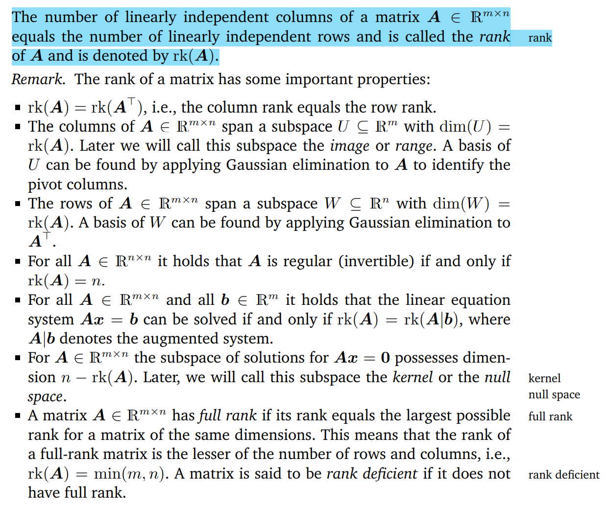
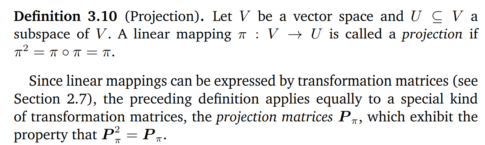
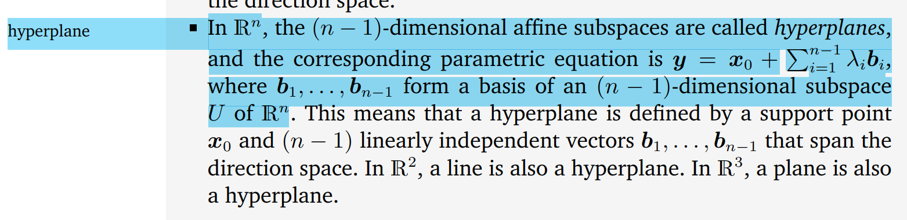
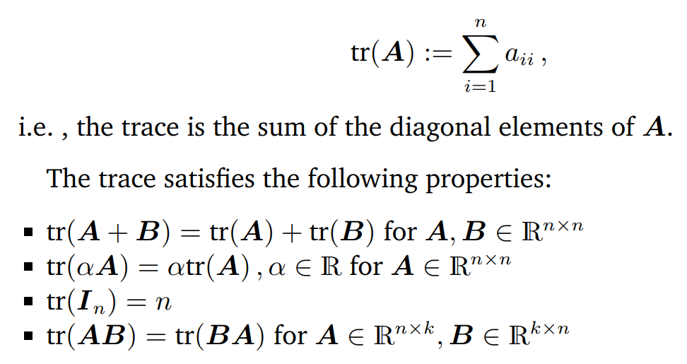
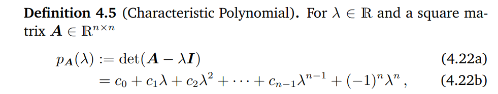
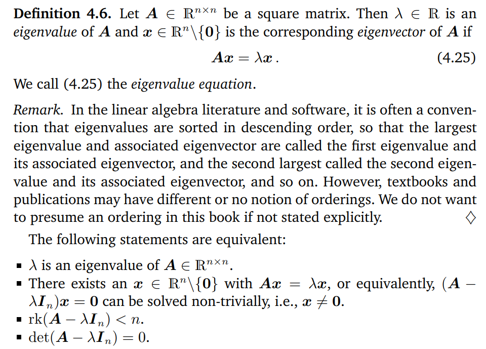
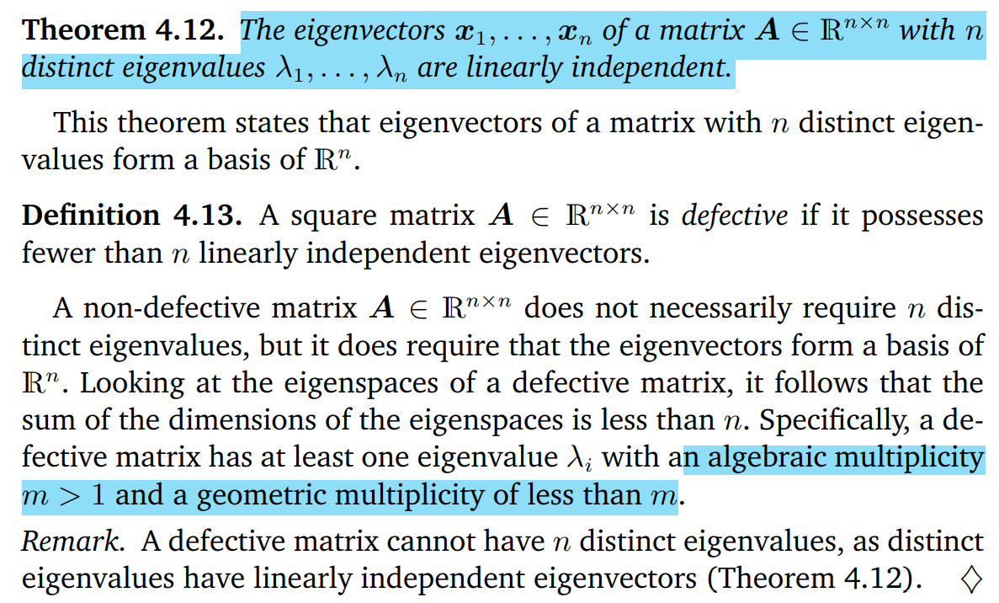
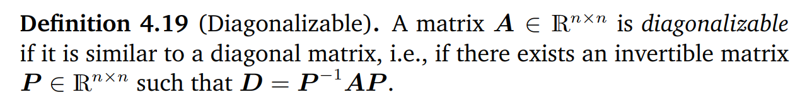
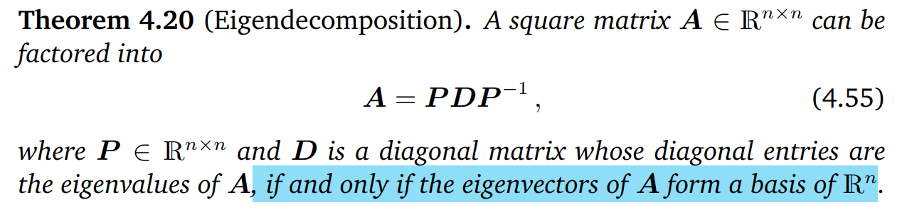

[TOC]

## Matrix
### Matrix Multiplication
$$y = x^\top A, $$ where $x\in \mathbb{R}^{m\times 1}, A\in \mathbb{R}^{m\times n}$. This equation can be viewed as linearly combining the **rows** of $A$ by elements in $x$.

$$y = Ax, $$ where $x\in \mathbb{R}^{n\times 1}, A\in \mathbb{R}^{m\times n}$. This equation can be viewed as linearly combining the **colomns** of $A$ by elements in $x$.

### Rank

#### Kernel (Null) Space and Image

- the **image** is spanned by the columns of the **transformation matrix**

### Similar and Equivalent Matrix

### Positive Symmetric Matrix and Inner Product

**Inner product definition:**

**Matrix perspective of inner product:**

for and $x\in \mathbb{R}^n$ and $x\ne \mathbf{0}$, $$x^\top A x>0$$
then $A$ is a **positive definite matrix**. If $A$ is symmetric, then $A$ is a **symmetric, positive definite matrix**.

There are properties of $A$ in case of inner product:

#### Distance (Metric)

There are properties of distance between two vectors:

### Orthogonal Matrix

There are properties of orthogonal matrix:

### Projection

### Affine Transformation

There are properties of affine transformation:

### Trace

### Characteristic Polynomial

### Eigenvalue and Eigenvectors

There are properties of eigenvalue and its associated eigenvectors:

#### Defective Matrix

#### Spectrum Theorum

#### Association with Determinant and Trace

### Diagnalization
#### Diagonalizable Matrix

#### Eigen Decomposition

## Intuition of Vector Space
A vector space $\mathbb{R}^n$ is spanned by a set of linearly independent vectors $\mathcal{X} = \{x_1,\cdots,x_k\}, x_i\in \mathbb{R}^n$ i.e. $$\sum_{i = 1}^k a_i x_i = \mathbf{0}$$ has the only solution that $x_i = \mathbf{0}$. $\mathcal{X}$ is called the **basis** of $\mathbb{R}^n$, and $k$ is the **dimension** of vector space $\mathbb{R}^n$.

Let's consider the example of $Ax = \mathbf{b}$, where $A\in \mathbb{R}^{m\times n}$. The solution of this equation system can be found by:
- find a particular solution to $Ax = \mathbf{b}$
- find all solutions to $Ax = \mathbf{0}$
- combine (add) the solutions from the last two steps

In order to find all solutions to $Ax = \mathbf{0}$, we have to:
- using **Gaussian Elimination** to transform the **coefficient matrix** $A$ to the **Reduced Row Echelon Form**
- express the **non-pivot** column by the linear combination of **pivot columns on their left**, obtaining a vector $\lambda_i$
- repeat last step until all non-pivot columns are processed, leading to a set of vectors $\mathcal{O} = \{\lambda_1, \cdots, \lambda_{n-r}\}$
- the final solution for $Ax = \mathbf{0}$ is $$\sum_{i = 1}^{n-r}a_i\lambda_i$$

Note that $r$ means the **rank** of $A$, which equals the number of the pivot columns of the reduced echelon form. Therefore, the solution for $Ax = \mathbf{b}$ is an **affine space** of $\mathbb{R}^n$ whose dimension is $n-r$.

Meanwhile, the **image** of $A$ is the vector subspace that is spanned by the **columns of $A$**, i.e. $$r = \mathsf{dim}(\mathsf{img}(f))$$

Also, if we regard $A\in \mathbb{R}^{m\times n}$ as a transformation matrix to convert the basis $\boldsymbol{\phi} = \{\phi_1,\cdots, \phi_n\}$ which spans $V\subseteq \mathbb{R}^n$ to the basis $\boldsymbol{\psi} = \{\psi_1,\cdots, \psi_m\}$ which spans $W\subseteq \mathbb{R}^m$ to , i.e.
$$f: V\rightarrow W\implies f(\phi_i) = \sum_{j = 1}^m a_{ji}\psi_i$$

Therefore, the matrix representation of $f$ can be expressed by:
$$f(\boldsymbol{\phi}) = \boldsymbol{\psi} A$$

The most important thing to perceive vector is that **it indicates the coordinates of the point with regard to the basis which it lies in.** Consider a vector $v\in V$, it points to a point in $V$, thus the dimension of $V$ equals to the number of the elements in $v$. Moreover, $v$ can be transformed to the vector in $W$ by $A$:
$$w = Av,$$ where $w\in R^{m}$ indicates the **same point** with respect to a new set of basis $\boldsymbol{\psi}$.

Note that the **number of elements in $\phi_i$** (i.e. $k, \phi_i \in \mathbb{R}^k$) is **not** necessarily equal to $m$. The same holds for $\psi_i$. However, the number of elements in $\phi_i$ is equal to the number of elements in $\psi_i$, which is $k$. Further, $$k \ge \max(m,n)$$

## Intuition of Eigenvalues and Eigenvectors

Given the matrix $A\in \mathbb{R}^{n\times n}$ and its eigenvalues $\{\lambda_1, \cdots, \lambda_k\}$, where $k\le n$. The following holds: $$Ax = \lambda_i x$$

Let's review some basic definitions:
- the **algebraic multiplicity** equals to how many times that $\lambda_i$ appearing in the characteristic polynomial of $A$
- the **geometric multiplicity** equals to the **dimension** of the vector subspace spanned by the eigenvectors associated with a specific eigenvalue
- the eigenvectors associated with different eigenvalues are **linearly independent**, particularly, those of the **symmetric matrix** are **orthogonal**

From the equation, if we regard $A$ as the transformation matrix from $V\in \mathbb{R}^n$, which is **spanned by the eigenvectors associated with $\lambda_i$**, to $W\in \mathbb{R}^n$, then the vector $v\in V$ is transformed into $w\in W$, and $$w=Av = \lambda_i v$$

## Tips
- for matrix $A\in \mathbb{R}^{m\times n}$, without loss of generalness, $A^\top A$ is always symmetric
  - if $r = \mathsf{rank}(A) < n$, then $A$ is positive semi-definite
  - if $r = \mathsf{rank}(A) = n$, then $A$ is positive definite